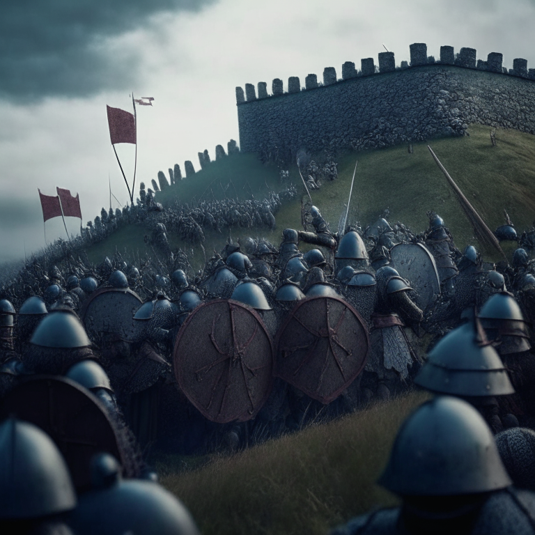
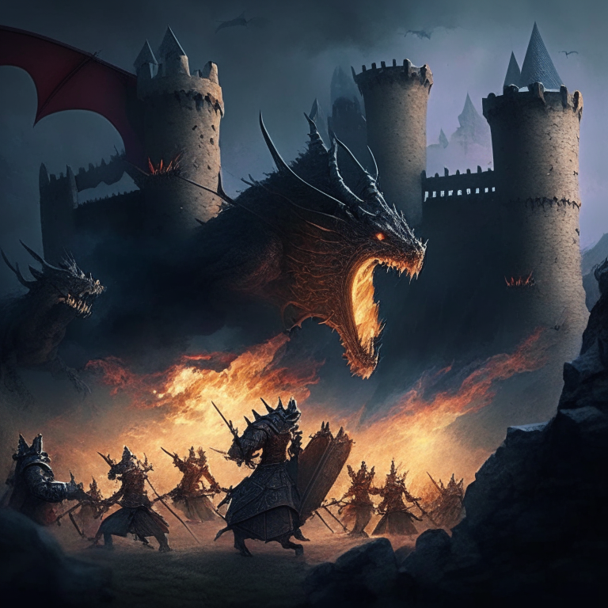
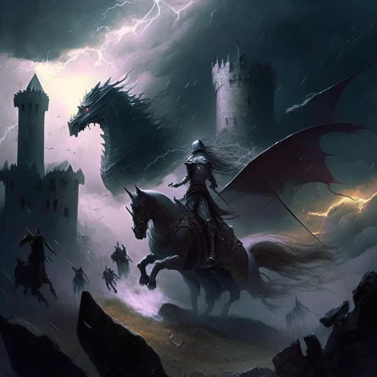
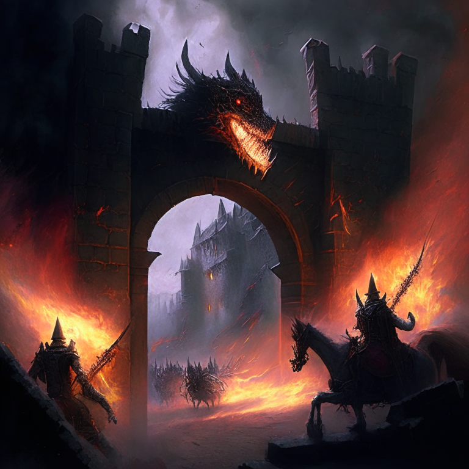
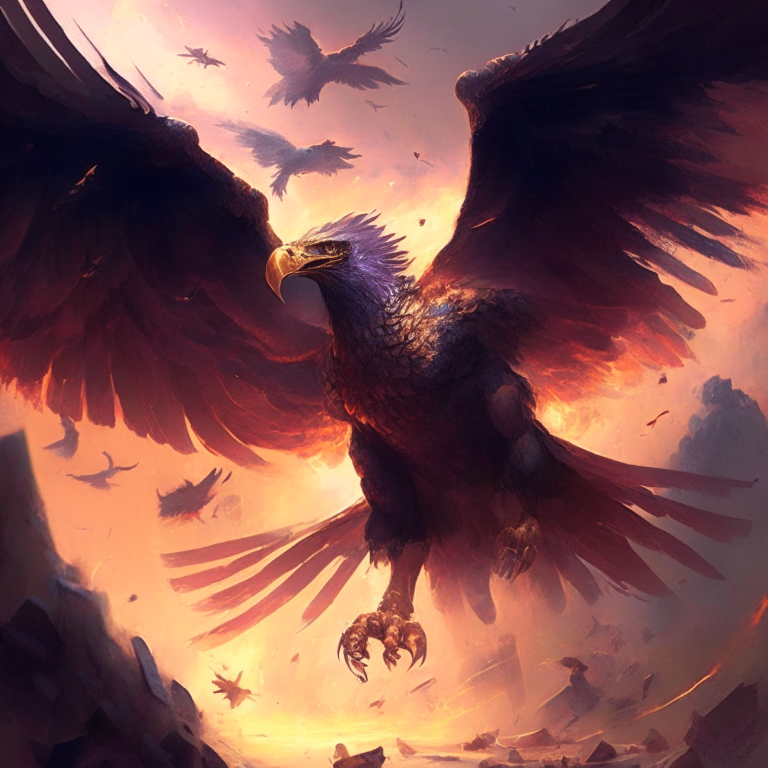
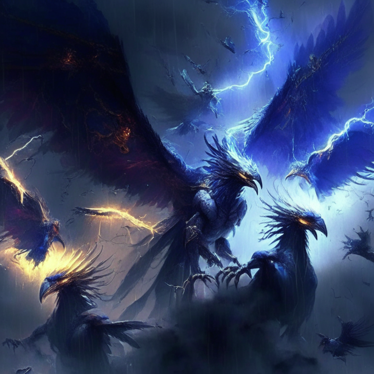
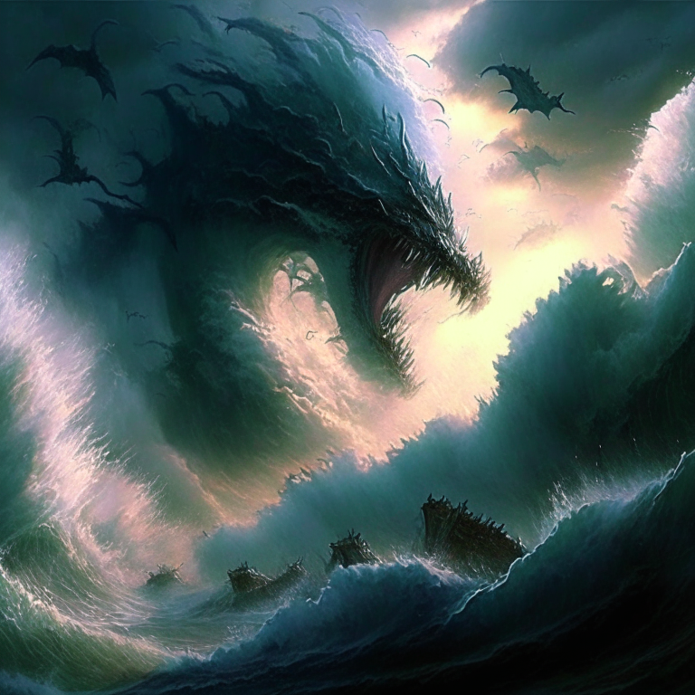
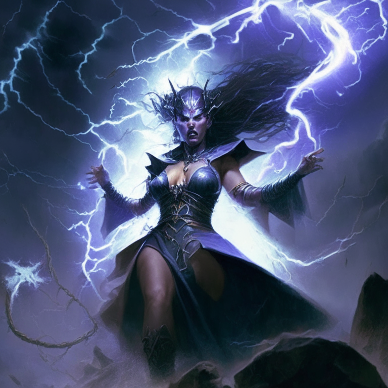
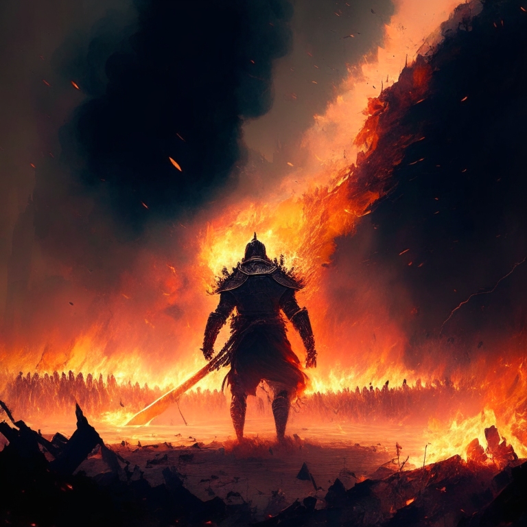

### The attacking force lined the hill in preparation for attack on the castle

### The defending force gathered their resources and marched to the top of the hill, forming a line of defense. They raised their swords and shields, ready to fight off the attackers. The castle walls opened and out flew a flock of dragons, breathing fire on the attacking force and driving them away

### The defending force quickly regrouped and summoned a powerful storm cloud. When the dragons flew back, they were met with a barrage of thunderbolts that sent them scattering back to the castle. The defenders then rode their horses down the hill, swords in hand, and charged the castle

### gates.The defenders summoned their own dragons to fight off the attacking force. They then used their magical powers to summon a wall of fire around the castle, preventing any further attack. Finally, they rode out on their horses and launched a fierce counterattack, raining arrows down upon the enemy forces

### The defenders summoned a giant eagle to carry them above the enemy forces, raining down fireballs from the sky. They then called upon the gods to create a powerful wind that blew away the attacking dragons. Finally, they created an earthquake that shook the ground, throwing off the enemy's aim

### The defenders called upon a mythical dragon to breathe a magical mist that shrouded the enemy forces, blinding them. They then summoned a flock of giant phoenixes to carry them above the enemy forces, raining down lightning bolts from the sky. Finally, they called upon the gods to create a

### massive tidal wave that washed the enemy forces away.Counter attack: The attackers commanded a legion of ghosts to create an impenetrable wall of fog, blocking the defenders from view. They unleashed a horde of giant dragons, raining down fire and brimstone from the heavens above. Finally,

### they called upon a powerful sorceress to conjure a massive lightning storm, striking down the enemy forces.

### Counter attack: Summoning a magical shield to protect your forces, you call upon the power of the wind to disperse the lightning storm. Then, you cast a powerful spell to create an earthquake, shaking the ground and toppling the enemy forces.

### Your forces rally and, with one last push of power, you unleash a massive wave of energy that sweeps away the enemy forces. The ground is left scorched and silent, a testament to your victory. The battle is won and the kingdom is saved.

