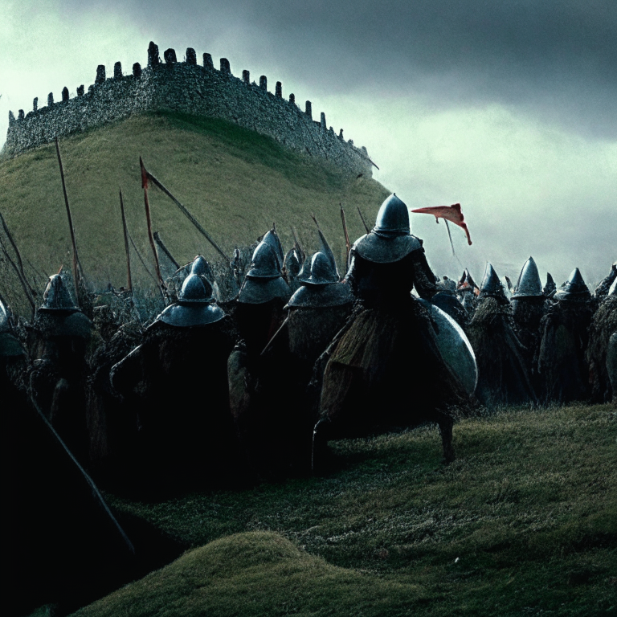
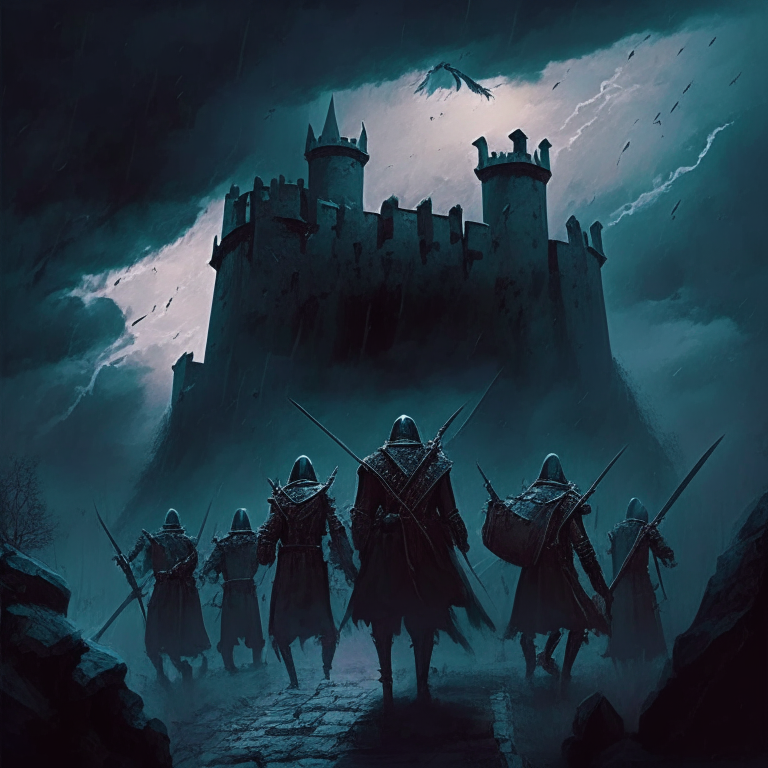
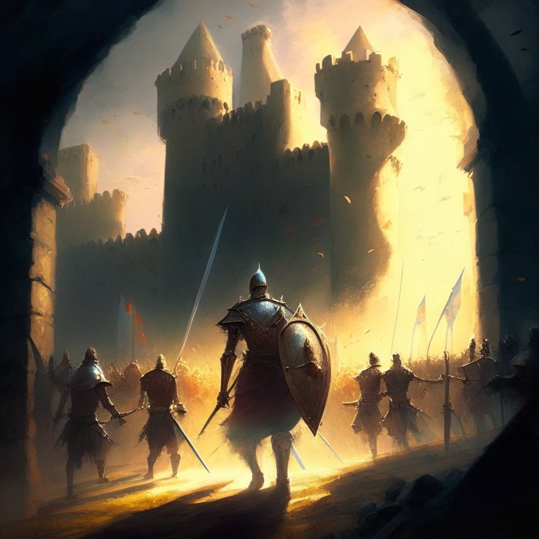
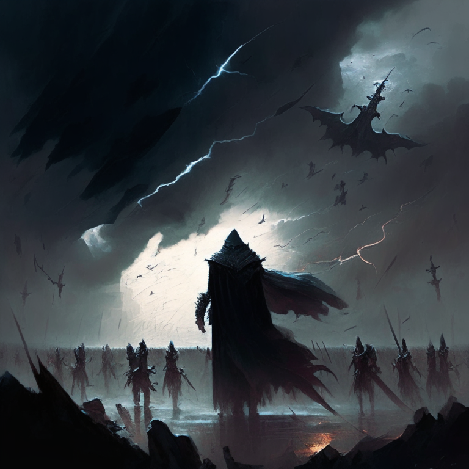
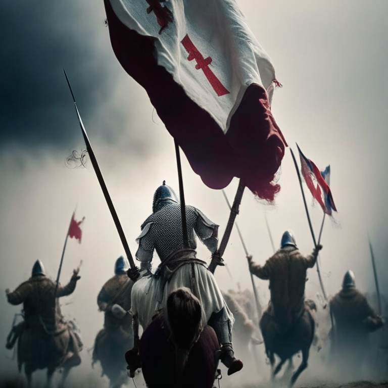
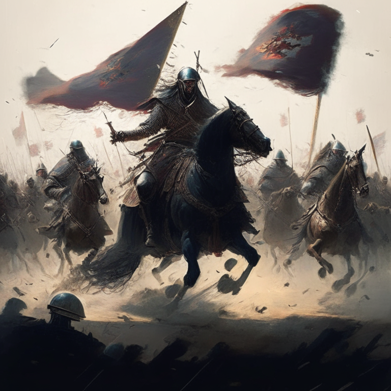
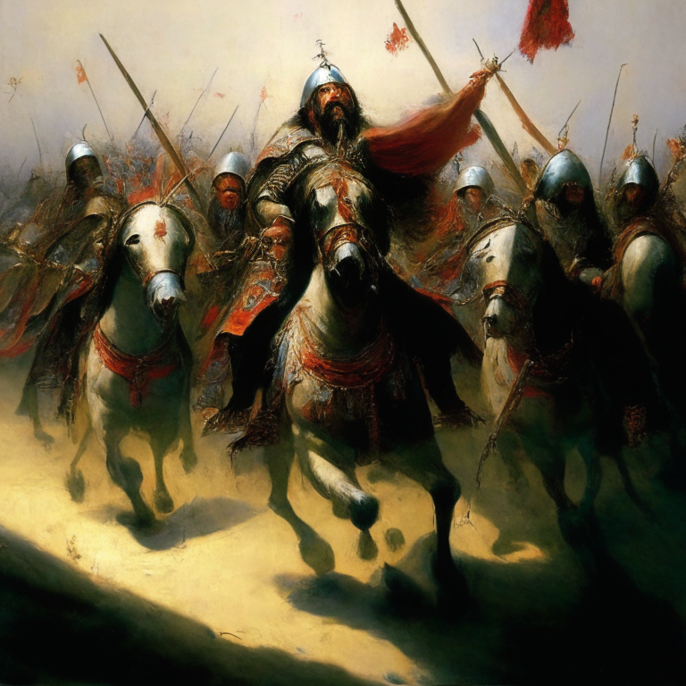
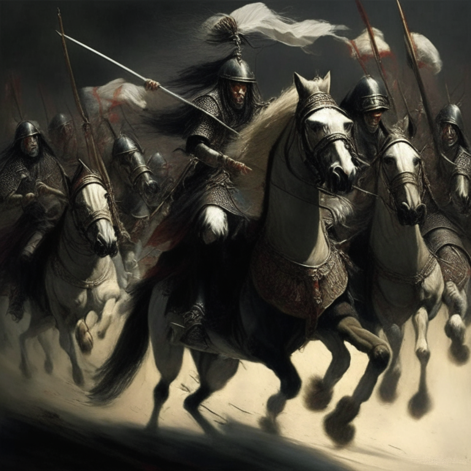
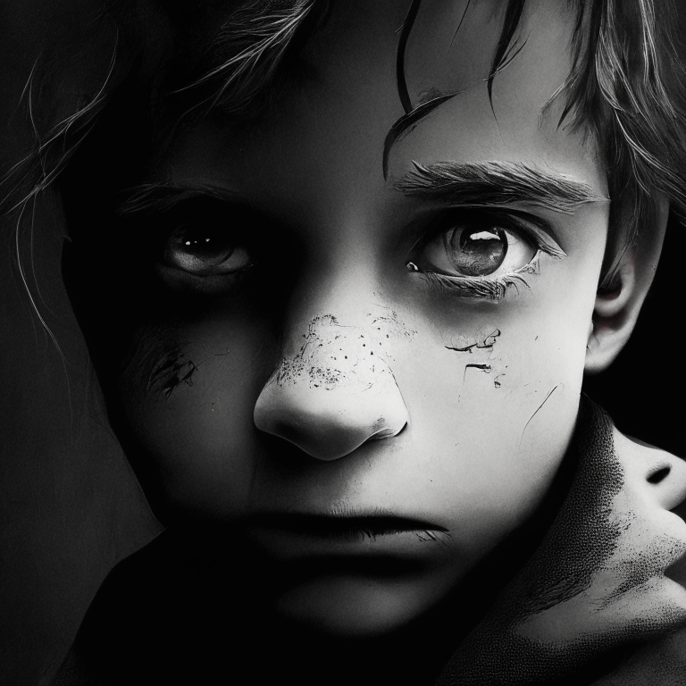
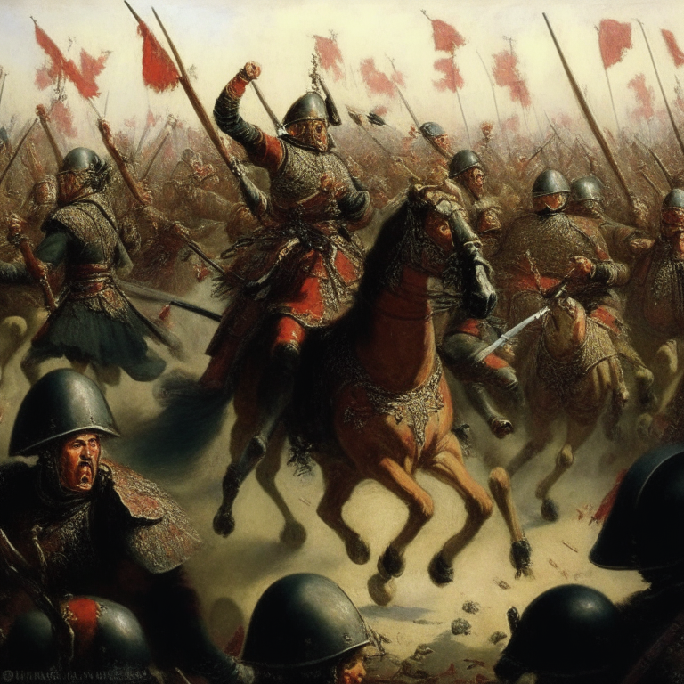

The attacking force lined the hill in preparation for attack on the castle

.

The painting would show the defenders of the castle forming a line at the entrance, with the leader in the center. They are all armed and ready to fight back against the attackers on the hill. The sky is dark and a storm is brewing, foreshadowing an epic battle.

The painting would show the defenders of the castle forming a line, with the leader in the center. He is leading a charge of brave warriors, each armed with their own weapon and shield. The sky is clear, with a bright sun shining down on them as they march forward to meet their

 enemy.

The painting would show the enemy in retreat, with their weapons discarded and shields broken. The leader of the defenders stands triumphantly in the center, his followers surrounding him as they raise their weapons in victory. The sky is dark, with lightning flashing in the background and a fierce wind

 blowing the banners of the defenders.

The painting shows a group of defenders charging forward, their swords raised and shields held high. Their leader is on horseback, blowing a horn to rally his troops and lead them into battle. The banners of the defenders wave proudly in the wind.

The painting shows a group of attackers, their swords raised and shields held high. Their leader is on horseback, blowing a horn to rally his troops and lead them into battle. The banners of the attackers wave proudly in the wind. The defenders are seen charging forward, their weapons drawn and

 their faces full of determination.

The painting shows a group of defenders, their swords drawn and shields held high. Their leader is on horseback, blowing a horn to rally his troops and lead them into battle. The banners of the defenders wave proudly in the wind as they charge forward with courage

 and determination.

A painting of a group of soldiers banding together in a circle, their shields raised in front of them, swords and spears held high in the air with a look of defiance. The soldiers are standing tall with courage and determination. 
A painting of a group of soldiers running forward,

