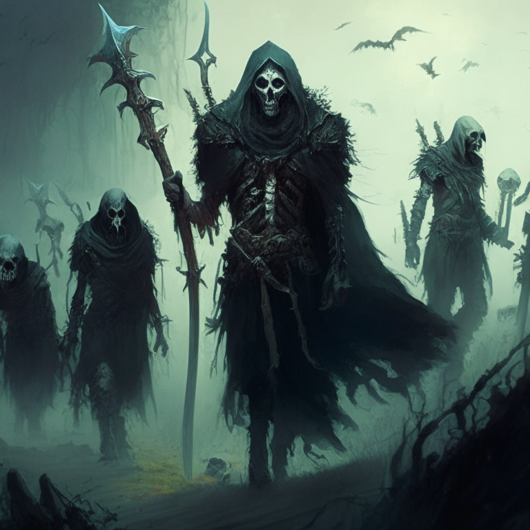

### The attacking force lined the hill in preparation for attack on the castle

### The defenders of the castle raised their shields and prepared for a fight. The castle's archers lined the walls, ready to rain down arrows on the attackers. The castle's mage cast a powerful spell that caused a wall of fire to rise up from the ground, blocking the attackers' path.

### The attackers retaliated by calling upon their own mage to summon a fierce storm, causing lightning to strike the wall of fire and break it apart. The archers were then overwhelmed by a flock of giant birds that swooped in and blocked their arrows. Lastly, the attackers unleashed a horde of undead warriors that marched towards the defenders.

### The defenders summoned a giant golem to protect them from the undead warriors and the mage created a powerful shield of light to protect them from the lightning. The archers then released a volley of arrows that were infused with magical energy, causing the undead warriors to retreat.

### Counter attack: Summon a powerful lightning strike to strike down the undead warriors, sending them back to their graves. Call forth an army of fierce dragons to surround the remaining undead and incinerate them with their fiery breath. Finally, cast a spell of protection around your kingdom to keep the undead from  ever returning.

[//]: # (![]&#40;fight6.png&#41;)

### The counter attack would be to summon a magical force field that will surround the attackers and keep them trapped outside the walls. The force field will be unbreakable and will prevent them from ever returning. Additionally, a powerful spell will be cast to make their weapons ineffective, ensuring they can never again attack the kingdom.

### Counter attack: The kingdom's army rallies together and launches an ambush on the enemy. They use their superior strategy and number to overwhelm the attackers. The enemy is forced to retreat in defeat.

