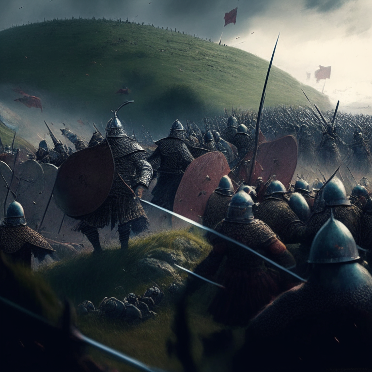
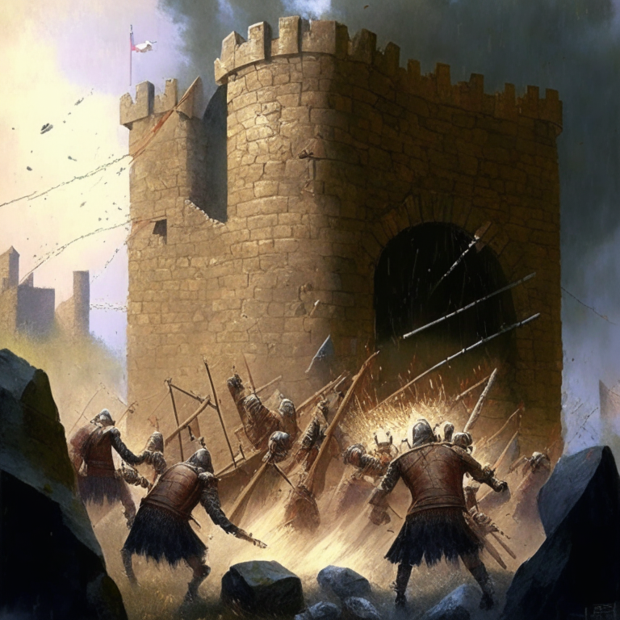
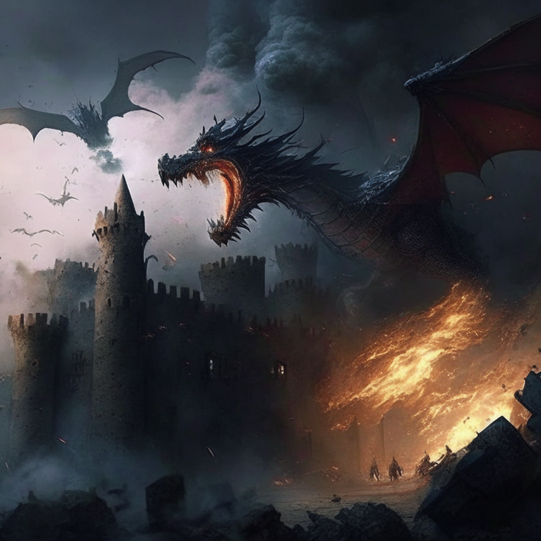
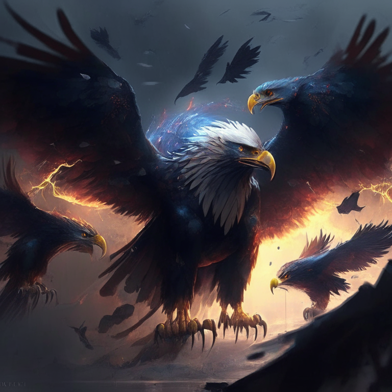
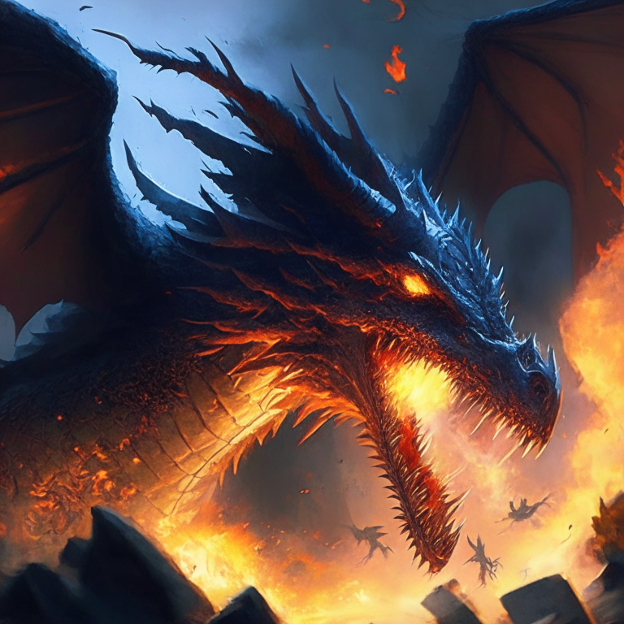
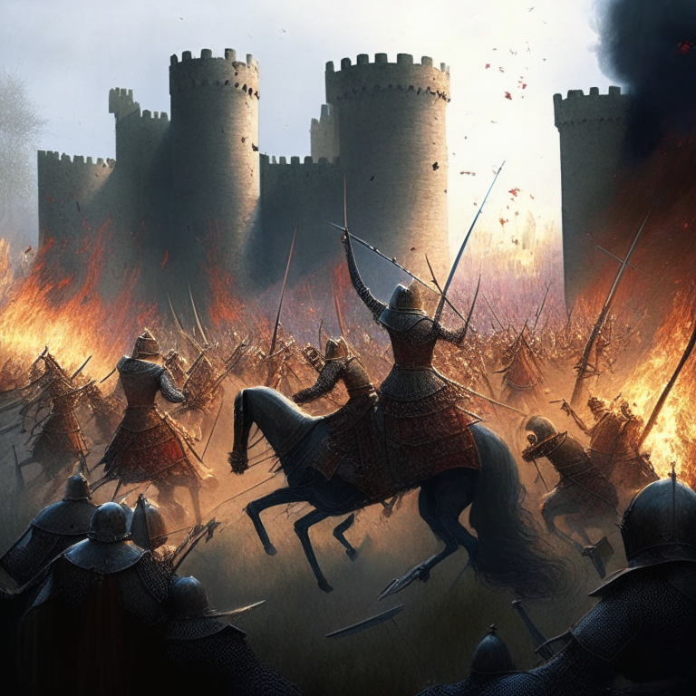
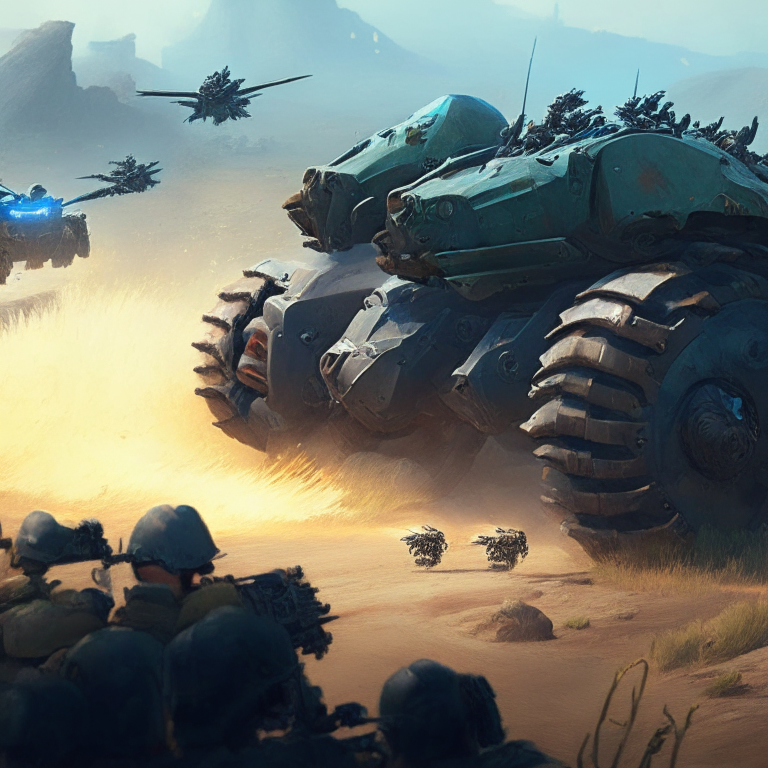
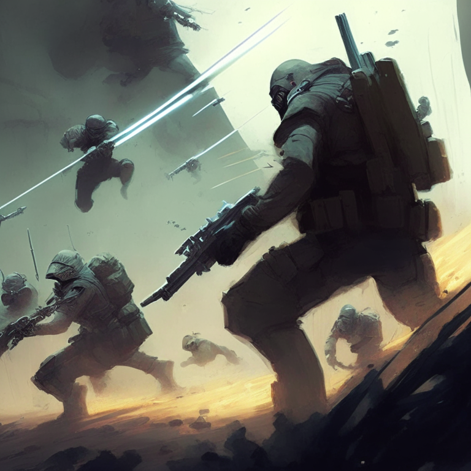
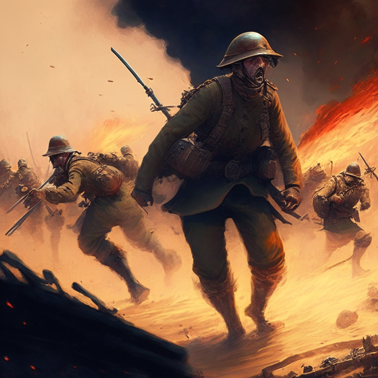

### The attacking force lined the hill in preparation for attack on the castle

### The defenders of the castle rallied their forces, readying their own siege weapons and preparing to rain down arrows upon the attackers. The castle's trebuchets were loaded with stones and launched, creating a shower of rocks that blocked the attackers' view of the castle.

### The attackers responded by sending a wave of fire-breathing dragons to the castle, raining down fire and smoke upon the defenders.
The defenders quickly summoned a powerful magical wind, which swept away the smoke and cooled the fires around the castle walls. They then sent forth a flock of

### giant eagles to battle the dragons, raining down arrows of light that dispelled the darkness and confusion.

### Your counter attack description: The dragons summoned a powerful wind, blowing the eagles away. They then released a wave of smoke that cloaked the battlefield, obscuring their enemies' vision. Finally, they unleashed a searing blast of fire that incinerated their foes.

### 

### The enemy has launched a surprise attack, sending a large army of knights and archers to storm the castle walls.

In response, the defenders launch a counterattack with a barrage of flaming arrows raining down from the castle towers, followed by a cavalry charge led by the king himself. The

### defenders mount a fierce defense, driving the enemy back and securing victory.

### The defenders launch a surprise attack, catching the enemy off guard and quickly gaining the upper hand. The defenders press their advantage and use their superior numbers to overwhelm the enemy, securing a decisive victory.

### The enemy regroups and launches a counter attack, using the element of surprise to their advantage. The enemy's superior tactics and strategy quickly turn the tide of the battle, allowing them to gain ground and eventually win the day. In a final show of strength, they manage to rout the defenders

